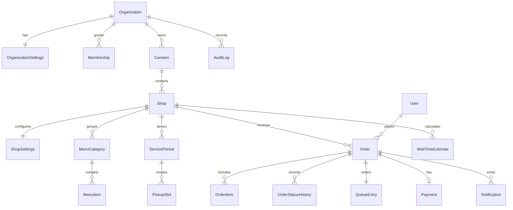
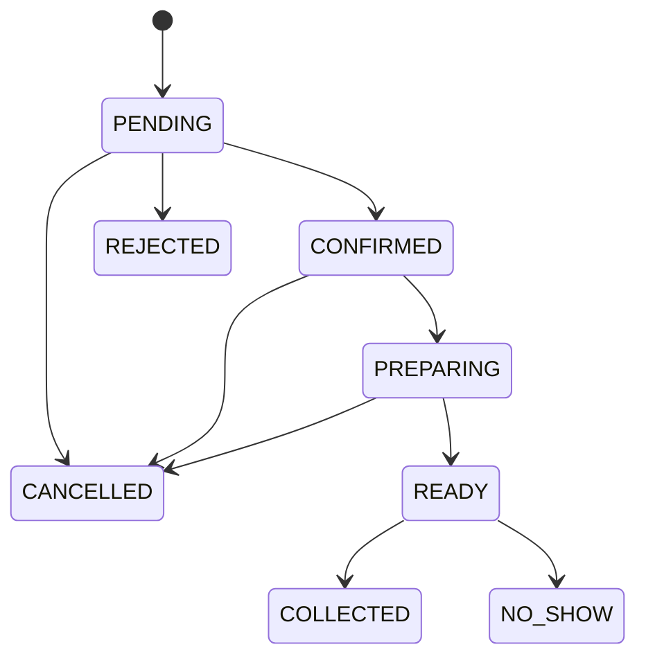

# JongFood MVP architecture

> The current server-backed contract is authoritative in [ARCHITECTURE.md](../../ARCHITECTURE.md), [ORDER_ENGINE.md](../../ORDER_ENGINE.md), and [CAPACITY_ENGINE.md](../../CAPACITY_ENGINE.md). The notes below preserve the original prototype rationale.

## Scope and decision

This checkout began as a dependency-light, browser-runnable MVP surface for validating the bilingual customer and merchant workflows. The current implementation keeps that UI while adding an HTTP API, server sessions, an explicit local/test adapter, PostgreSQL migrations, transactional capacity, and server-side authorization.

The production target is a Node application with PostgreSQL, server-side sessions, and explicit authorization. Prisma/Auth.js are not required by the current implementation; the boundary is kept visible through `PostgresStore`, the migration, and the live-proof register.

## Current layers

```text
index.html                 application shell and accessible landmarks
styles.css                 global, alias, and component design tokens
app.js                     view state, bilingual copy, server hydration, event handlers
src/domain.mjs             pure slot, capacity, wait, price, priority, and status rules
tests/domain.test.mjs      deterministic domain tests
server.mjs                 configured HTTP server and store selection
docs/                      product, architecture, operations, and security notes
```

The UI calls domain functions instead of embedding calculations in templates. Orders, capacity, availability, identity, and status live in the server adapter; localStorage is not used as a production source of truth.

## Production entity overview



Every production row that can be reached by a user operation carries or inherits an `organizationId` boundary. `Membership` and `ShopStaffAssignment` provide role and shop scope; platform administration stays in the model but outside the main MVP workflow.

## Role and permission matrix

| Capability | Customer | Staff | Manager | Organization admin |
| --- | --- | --- | --- | --- |
| Browse available menus | Own organization surface | Assigned shops | Organization shops | Organization shops |
| Create pre-order / walk-in | Configured customer modes | Assigned shops | Organization shops | Organization shops |
| Update order status | Own cancellation only | Assigned shops | Organization shops | Organization shops |
| Toggle item availability | No | Assigned shops if permitted | Organization shops | Organization shops |
| Configure wait and capacity | No | If explicitly permitted | Assigned shops | Defaults and all shops |
| Manage users and assignments | No | No | Staff assignments | Organization-wide |
| Audit and reports | Own order history | Shop operations | Shop reports | Organization reports |

## Core algorithms

### Slot capacity

The production `createOrder` transaction must validate shop, period, menu availability, authoritative price, and `capacityUnits`; lock or atomically update the selected slot; then create the order, items, queue entry, and initial status history in one commit. The demo exposes the same calculation through `getSlotAvailability` but has no database lock.

### Wait estimate

```text
remainingWorkUnits = active + incoming + nearTermReserved
effectiveCapacityPerMinute = baseCapacityPerMinute × activeCapacityMultiplier
rawWait = remainingWorkUnits / effectiveCapacityPerMinute + buffer + manualDelay
displayedRange = rounded(rawWait × lowerMultiplier) … rounded(rawWait × upperMultiplier)
```

The result carries lower and upper minutes, a ready timestamp, confidence, source, version, and calculation time. UI copy calls it an estimate, never a guarantee.

### Priority

The deterministic strategy scores committed ready time first, confirmation time second, and order type third. Walk-ins do not automatically jump scheduled pre-orders. A manual override requires a reason and audit record in production.

## Order state machine



No UI may write arbitrary status values. The domain transition service validates the edge and appends an immutable status-history entry.

## Bilingual and localization approach

The demo keeps UI copy in a `copy.th` / `copy.en` map and all shop/menu names as `{ th, en }` values. The language toggle updates the document language, re-renders visible copy, formats Thai Baht using the active locale, and preserves the current order/cart state. A production version should move the same keys to a typed localization layer and use organization settings for locale, time zone, date format, and currency.

## Known boundaries

- No server, database, authentication session, tenant check, or server-side authorization is implemented in this demo.
- The explicit memory adapter is a walkthrough/test persistence layer, not a production source of truth.
- Payment is “pay at shop”; no provider is connected and no card details are accepted.
- Notifications are in-app only.
- The sample images are remote Unsplash URLs and should be replaced or proxied for production.
- Tests cover pure rules, not database concurrency, browser flows, or provider integrations.
